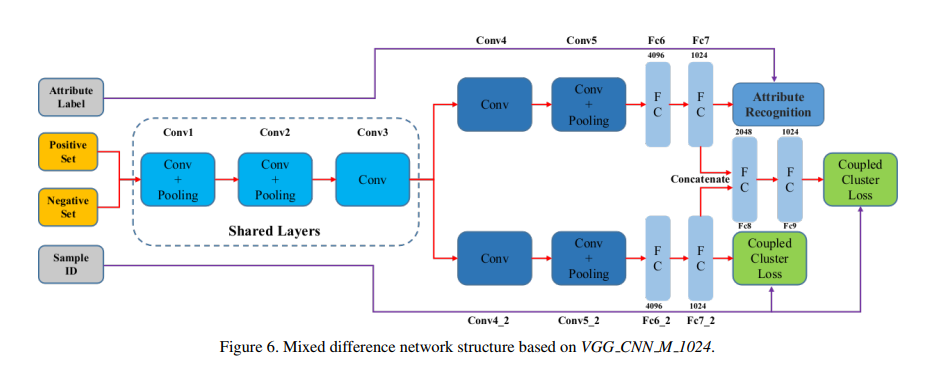

# scia_project_all

## image_generation

* image generation randomly and directly.</br>


## RepNet_dataset

### Dataset: </br>
* [VehicleID dataset](https://pan.baidu.com/s/1JKOysKjrlgReuxZ2ONCmUQ) </br>

### Pre-trained model
* [model](https://pan.baidu.com/s/1vJiwBfR3f9Zc9NCuUbmEsw) </br>
* extract code: 62wn

## transport_pic

* The tool can be run as a Python script, e.g.:
```
python3 heic2jpg.py -d <data_dir> -o <out_dir> -m 1000000 -rec -v -resize 50% -quality 50%
```
* It supports all arguments for the `imagemagick convert` tool, and additionally the following arguments:
```
-d, --data: Input file/directory
-o, --out: Output file/directory. Default: Same as input directory/file with .jpg extension.
-rec, --recursive: Recursively process subdirectories if input is a directory.
-v, --verbose: Increase verbosity.
-q, --quality: Quality of converted file (integer in [0, 100]). Default = 90.
```

## Vehicle_search_dwx

* InitRepNet.py
* ProcessVehicleID.py
* RepNet_dwx.py
### Network structure: </br>


### Reference: </br>
* [Deep Relative Distance Learning: Tell the Difference Between Similar Vehicles](https://www.cv-foundation.org/openaccess/content_cvpr_2016/papers/Liu_Deep_Relative_Distance_CVPR_2016_paper.pdf) </br>
* [Learning a repression network for precise vehicle search](https://arxiv.org/pdf/1708.02386.pdf) </br>

